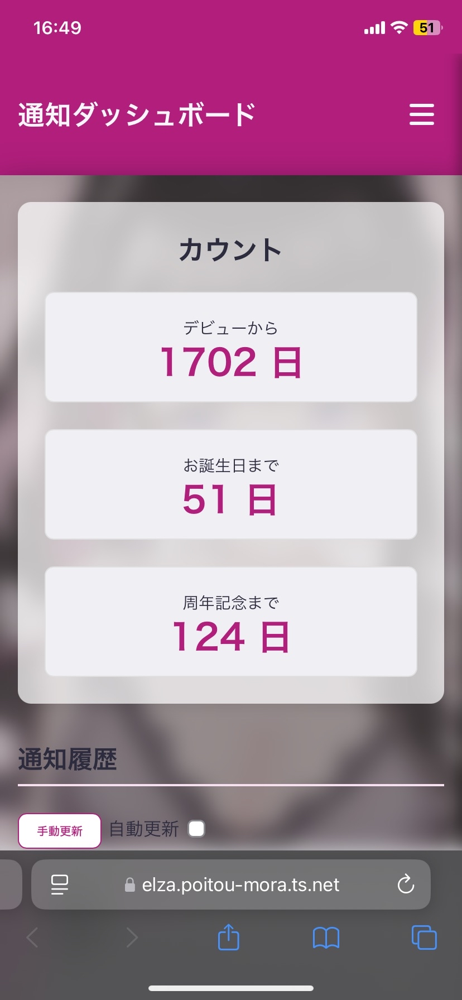
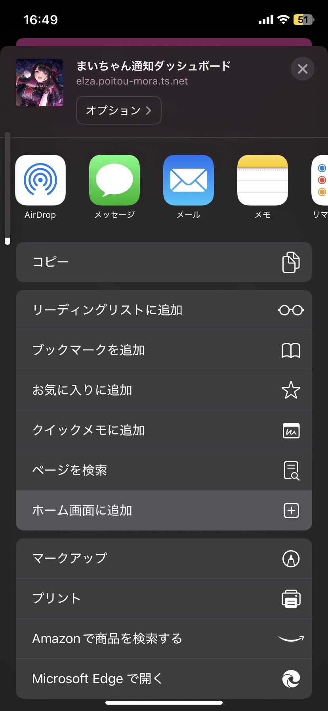
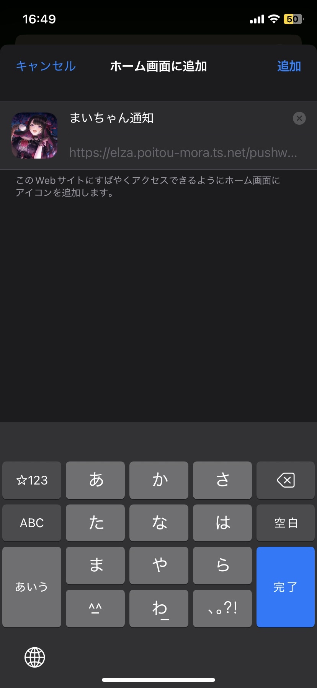
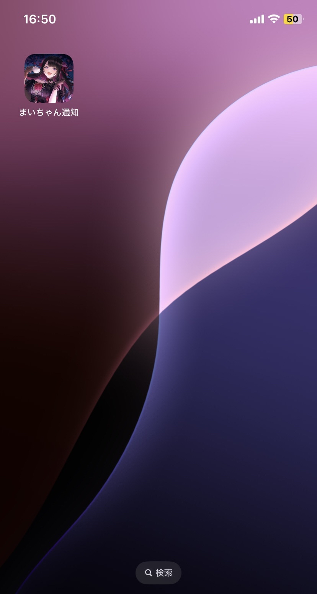
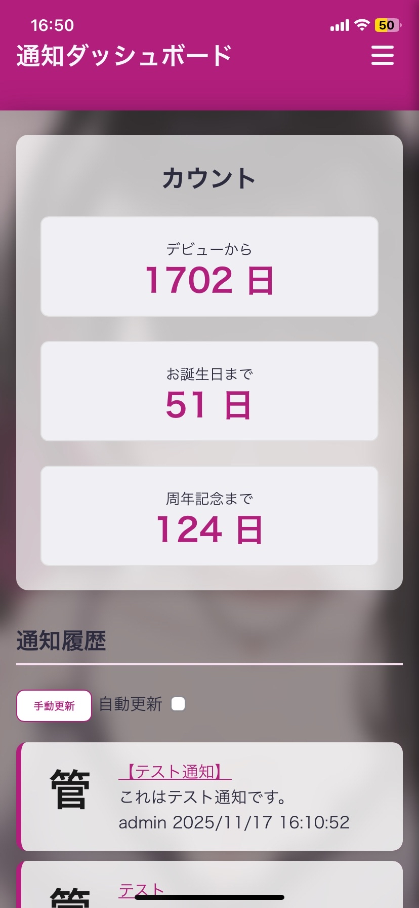
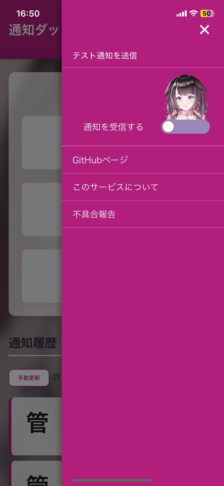
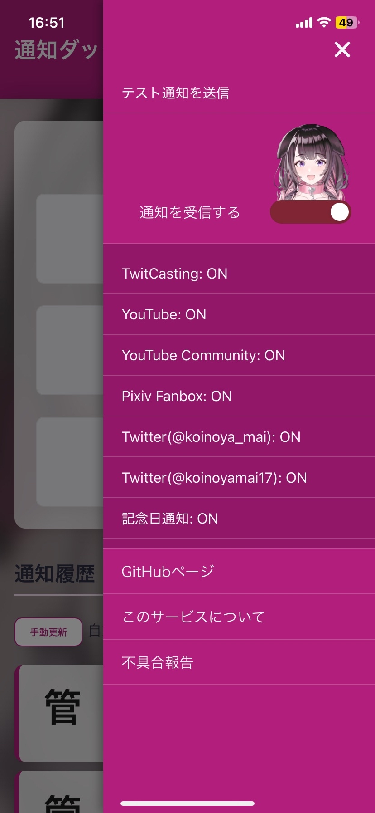
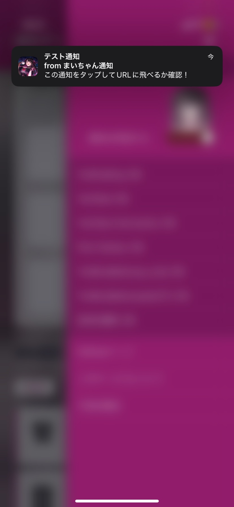
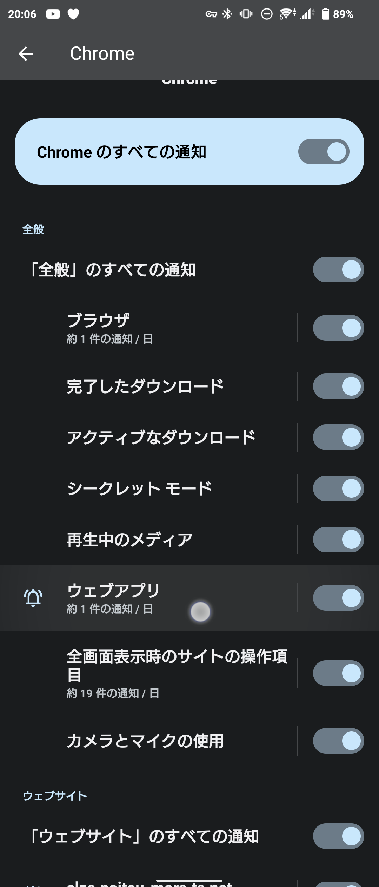

# まいちゃんWeb通知サービス (README)

このリポジトリは「まいちゃん」に関する通知を確実に受け取るための Web 通知サービスの説明と設定手順をまとめたものです。  
サイト本体は WebUI を介して通知の購読設定を行います。

---

## 目次

- [概要](#概要)
- [受け取れる通知](#受け取れる通知)
- ##[iPhone（iOS）手順](iPhone(iOS)手順)
- [PC/Android](#PC/Android)
  - [Android設定](#Android設定)
  - [Androidをホーム画面に追加(Webアプリ化)](#Androidをホーム画面に追加(Webアプリ化))
- [運用・注意点](#運用注意点)
- [不具合報告](#不具合報告)
- [開発者メモ](#開発者メモ)
---

## 概要

このサービスは、まいちゃん関連（配信・投稿・記念日等）の通知を遅延少なく受け取ることを目的に開発されています。Web プッシュ（ブラウザ通知）を用いて端末に直接通知を送信します。

---

## 受け取れる通知

* ツイキャス配信
* YouTube（配信・動画・コミュニティ投稿）
* Twitter（投稿）
* Pixiv Fanbox（ファンクラブ投稿）
* 記念日通知（デビュー日からの日数、お誕生日、周年など）

> 配信・動画（ツイキャス / YouTube）はほぼ無遅延で届きます。Twitter は約1分、YouTubeコミュニティ / Pixiv Fanbox は約3分の遅延が発生する場合があります。

---

### iPhone(iOS)手順

1. Safari で URL を開く。
   * `https://elza.poitou-mora.ts.net/pushweb/`
2. 画面下の共有ボタン⎙をタップ。

   
3. 「ホーム画面に追加」を選択して、任意のアプリ名で追加。

   
   
4. ホーム画面に追加したアイコンをタップして起動する。

   
5. 右上のハンバーガーメニューを開く（または横スワイプでメニュー表示）。


6. 「通知を受信する」をオンにして、通知の許可ダイアログで許可する。
   * ユーザーネームは任意で入力可能。



   
7. 「テスト通知」ボタンを押して、受信と指定ページ遷移が正常に動作するか確認する。

   

> ※ テストページは実際に開いてからのお楽しみ。

---

## PC/Android

1. 共通 URL を開く。

   * `https://elza.poitou-mora.ts.net/pushweb/`
  

2. 右上のハンバーガーメニューを開く。

3. 「通知を受信する」をオンにして、表示される各プラットフォーム設定を必要に応じて有効化する。

4. 「テスト通知を送信」を実行し、デバイス側で通知が表示されること、通知から指定 URL に遷移できることを確認する。

#### 注意点

* テスト通知が失敗する場合はサイトの通知許可をしてください。ちなみにEdgeは何故かできません。

---

## Android設定

# 推奨ブラウザ

* Chrome を推奨（Brave,Firefox 等でも可）。

## Chrome の通知設定確認手順

1. Chrome を開き、右上のメニュー（3点） → **設定** → **通知** を選択。
   
2. サイト一覧から `elza.poitou-mora.ts.net` を選択して詳細設定を行う。

   
3. 推奨設定例（参考）：

   * 通知表示をデフォルトに設定
   * ポップアップ通知をオン
   * 音は任意（運用方針に合わせて）
   * 通知ドット表示をオン
   * 重要な通知をオン

これらの設定により、Android では遅延なく通知を受け取れることが多いです。


---

## Androidをホーム画面に追加(Web アプリ化)

* Chrome のメニューから「ホーム画面に追加」で Web アプリ化可能です。Web アプリ化した場合、通知の管理はブラウザ（Chrome）ではなくアプリ単位の通知設定になります。
* アプリ化した後は、端末のアプリ通知設定または当該ウェブアプリ内の通知設定から調整してください。
* Chromeの場合は通知設定の中のウェブアプリで通知設定ができます。


---

## トラブルシューティング

* **通知が来ない**

---

## 運用・注意点

- プラットフォーム側の API 制限や障害、サーバーメンテによって遅延が発生する場合があります。  
- 通知が来ない場合は、ブラウザの通知設定・PWA 設定・権限を確認してください。  
- 修正対応には時間がかかることがあります。

---

## 不具合報告

不具合は以下から送信可能です。  
使用端末・ブラウザ・スクショがあると非常に助かります。

- WebUI 内の「不具合報告」
- フォーム:  
  https://form.jotform.com/253191048959063

---

## ライセンス / 注意事項

本サービスの利用は自己責任で行ってください。  
プライバシー・セキュリティに関する問い合わせは不具合報告フォームへ。

---

## 開発者メモ

# pm2

- log
```
pm2 logs mai-push-api --lines 100
pm2 logs mai-push-worker --lines100
```
- start restart
```
pm2 start server.js --name mai-push-api
pm2 start main.js --name mai-push-worker

pm2 restart all --env production
```
- info
```
pm2 describe mai-push
```

# DB

```
sqlite3 data.db

.tables
.headers on
.mode column
.mode csv
SELECT * FROM subscription;

#delete
DELETE FROM notifications
WHERE id IN (32, 35, 36, 37, 38);


```
