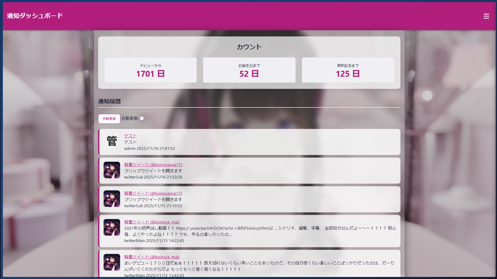
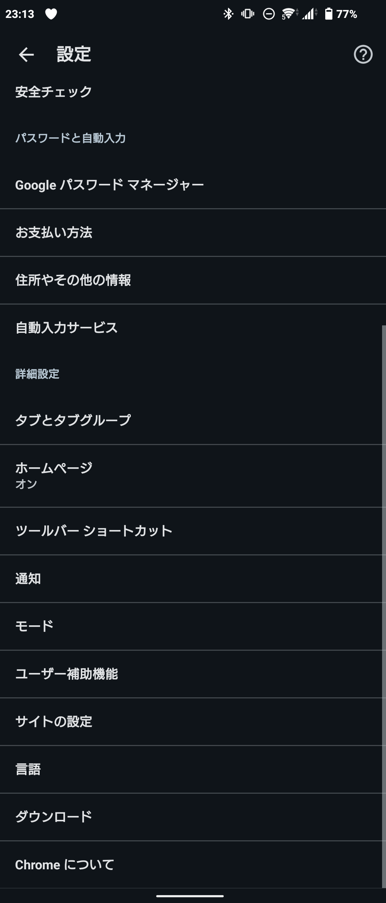
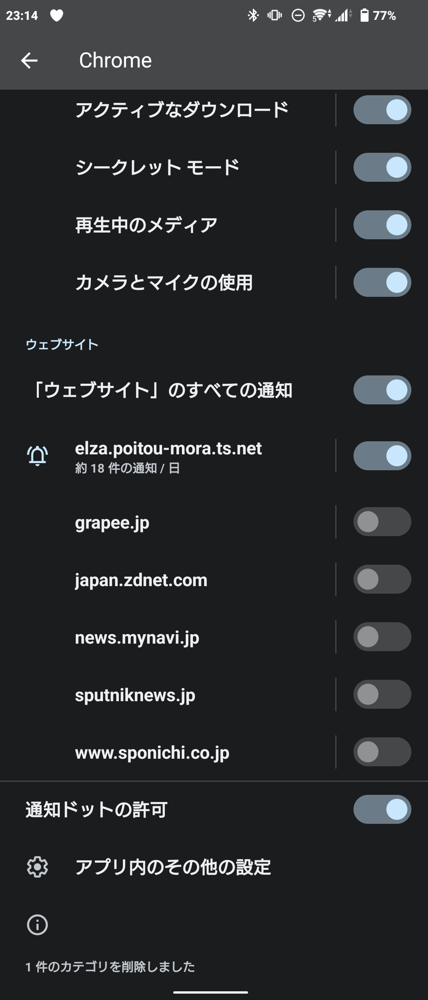
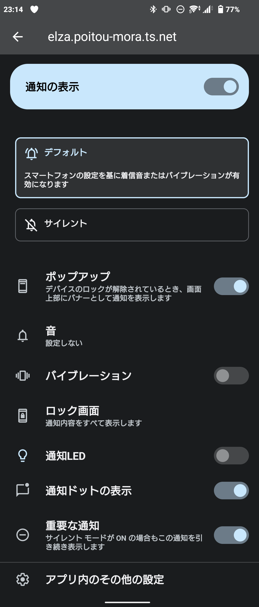

# まいちゃんWeb通知サービス (README)

このリポジトリは「まいちゃん」に関する通知を確実に受け取るための Web 通知サービスの説明と設定手順をまとめたものです。  
サイト本体は WebUI を介して通知の購読設定を行います。

---

## 目次

- [概要](#概要)
- [Web UI の使い方](#web-ui-の使い方)
  - [基本操作](#基本操作)
  - [受信可能な通知（現時点: 2025/11/16）](#受信可能な通知現時点-20251116)
  - [通知許可のテスト手順](#通知許可のテスト手順)
- [各デバイスでの設定](#各デバイスでの設定)
  - [PC（Windows / Linux）](#pcwindows--linux)
  - [Android（推奨ブラウザ: Chrome / Brave）](#android推奨ブラウザ-chrome--brave)
  - [iOS（制約あり）](#ios制約あり)
- [運用・注意点](#運用注意点)
- [不具合報告](#不具合報告)
- [関連リンク](#関連リンク)

---

## 概要

このサービスは、まいちゃん関連（配信・投稿・記念日等）の通知を遅延少なく受け取ることを目的に開発されています。Web プッシュ（ブラウザ通知）を用いて端末に直接通知を送信します。

---

## Web UI の使い方

Web UI（公開 URL）:  
https://elza.poitou-mora.ts.net/pushweb/

### 基本操作
1. 画面右上の **ハンバーガーメニュー** を開く。  
   
2. メニュー内の **通知を受信する** を選び、まいちゃんを「笑顔（通知をオン）」にする。  
   すると各プラットフォームごとの購読設定項目が表示されます（各デバイスでの設定は次節参照）。
   

### 受信可能な通知（現時点: 2025/11/16）
- ツイキャス（配信通知） — ほぼ無遅延  
- YouTube（配信・動画・コミュニティ投稿）  
  - 配信 / 動画: ほぼ無遅延  
  - コミュニティ投稿: 約 3 分遅延  
- Twitter — 約 1 分遅延  
- Pixiv Fanbox — 約 3 分遅延  
- 記念日通知（デビュー日からの日数、誕生日、周年など）

※ サーバー管理者からのメンテナンス通知が送信される場合があります。  
※ サーバー稼働時間は 1 日あたり 23 時間（6:17〜翌 5:16）。

### 通知許可のテスト手順
1. 通知をオンにするとブラウザの通知許可ダイアログが表示されるので「許可」を選択。  
2. 許可後、サイトの「テスト通知を送信」をタップして端末に通知が届くか確認。
   
   
3. 届いた通知をタップし、指定の URL テストページに遷移できれば完了。
   

---

## 各デバイスでの設定

管理者が実機確認できている環境は Windows / Linux / Android のみです。  
MacOS / iOS の動作は公式仕様に依存します。

### PC（Windows / Linux）
- 動作確認済みブラウザ: Firefox / Chrome  
- 通知許可を行うだけで利用可能。

### Android（Chrome 推奨）

手順:
1. Chrome → 右上メニュー → **設定** → **通知**

2. `elza.poitou-mora.net` を選択して通知権限を設定

推奨設定:
- ポップアップ通知: ON  
- 音: 任意  
- 通知ドット: ON  
- 重要な通知: ON

これで Android では遅延なく通知が届きます。

### iOS（制約あり）

動作条件:
- iOS 16.4 以降  
- PWA（ホーム画面追加）として起動した場合のみ Web Push が動作  
- 実機検証なし

参考記事（説明が分かりやすい）:  
https://tech.gamewith.co.jp/entry/2023/07/05/150509

---

## 運用・注意点

- プラットフォーム側の API 制限や障害、サーバーメンテによって遅延が発生する場合があります。  
- 通知が来ない場合は、ブラウザの通知設定・PWA 設定・権限を確認してください。  
- 修正対応には時間がかかることがあります。

---

## 不具合報告

不具合は以下から送信可能です。  
使用端末・ブラウザ・スクショがあると非常に助かります。

- WebUI 内の「不具合報告」
- フォーム:  
  https://form.jotform.com/253191048959063

---

## 関連リンク

- WebUI: https://elza.poitou-mora.ts.net/pushweb/  
- iOS Web Push 解説: https://tech.gamewith.co.jp/entry/2023/07/05/150509  
- 不具合報告フォーム: https://form.jotform.com/253191048959063

---

## ライセンス / 注意事項

本サービスの利用は自己責任で行ってください。  
プライバシー・セキュリティに関する問い合わせは不具合報告フォームへ。

